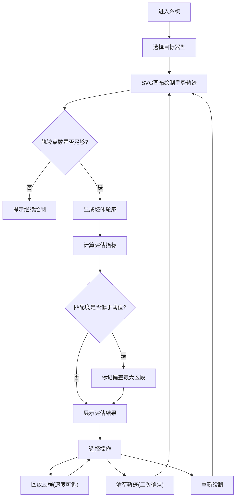

## 1. 产品概述
本项目是一个陶艺拉坯手势轨迹练习系统，帮助陶艺学习者通过数字化方式练习拉坯手势，对比目标器型轮廓，提升拉坯技艺。
- 核心功能：目标器型选择、手势轨迹记录、坯体轮廓生成、质量评估、过程回放
- 目标用户：陶艺初学者、爱好者、专业陶艺工作者

## 2. 核心功能

### 2.1 用户角色
| 角色 | 注册方式 | 核心权限 |
|------|----------|----------|
| 普通用户 | 无需注册 | 使用全部练习功能，查看评估结果 |

### 2.2 功能模块
1. **器型选择页**：碗、瓶、罐等目标器型选择展示
2. **练习画布页**：SVG 画布手势记录、坯体轮廓生成、实时反馈
3. **评估分析页**：对称性、平滑度、匹配度指标展示，偏差区段标记
4. **过程回放页**：手势轨迹回放，速度可调

### 2.3 页面详情
| 页面名称 | 模块名称 | 功能描述 |
|----------|----------|----------|
| 练习主页面 | 器型选择 | 选择目标器型（碗、瓶、罐等），展示器型轮廓预览 |
| 练习主页面 | SVG 画布 | 支持鼠标/触控绘制手势轨迹，实时显示绘制路径 |
| 练习主页面 | 轮廓生成 | 根据轨迹点生成坯体轮廓，轨迹点不足时禁止生成 |
| 练习主页面 | 质量评估 | 计算左右对称性、曲线平滑度、目标匹配度 |
| 练习主页面 | 数据可视化 | ApexCharts 展示评估指标雷达图、偏差曲线 |
| 练习主页面 | 过程回放 | 回放手势绘制过程，支持 0.5x-2x 速度调节 |
| 练习主页面 | 操作控制 | 生成轮廓、开始回放、清空轨迹（二次确认） |

## 3. 核心流程
用户进入系统后首先选择目标器型，然后在 SVG 画布上用鼠标或触控绘制手势轨迹。系统根据轨迹点生成坯体轮廓，计算各项评估指标，标记偏差最大的区段。用户可以调整回放速度查看整个绘制过程，或清空轨迹重新练习。

## 4. 用户界面设计

### 4.1 设计风格
- **主色调**：陶土褐色 (#8B4513) 作为主色，体现陶艺质感
- **辅助色**：青瓷绿 (#7CB342) 作为成功/匹配色，朱砂红 (#C62828) 作为偏差/警告色
- **中性色**：米白色背景 (#F5F0E6)，深棕色文字 (#3E2723)
- **按钮风格**：圆角矩形，陶土质感渐变，悬停时轻微上浮阴影
- **字体**：标题使用 "ZCOOL XiaoWei" 艺术字体，正文使用 "Noto Sans SC"
- **布局风格**：三栏布局，左侧器型选择，中间 SVG 画布，右侧评估面板
- **图标风格**：线性陶艺主题图标，线条简洁流畅

### 4.2 页面设计概述
| 页面名称 | 模块名称 | UI 元素 |
|----------|----------|----------|
| 练习主页面 | 器型选择区 | 卡片式器型列表，选中态边框高亮，悬停放大效果 |
| 练习主页面 | SVG 画布区 | 深色画布背景，网格辅助线，陶土坯体渐变填充 |
| 练习主页面 | 评估面板区 | 卡片式指标展示，进度条动画，雷达图平滑过渡 |
| 练习主页面 | 控制栏区 | 横向排列操作按钮，分隔线区分功能组 |

### 4.3 响应式
- **桌面端优先**：三栏布局，固定宽度侧边栏，自适应画布区域
- **平板端**：两栏布局，器型选择与控制栏合并，画布与评估面板垂直排列
- **移动端**：单栏流式布局，器型选择水平滚动，画布全屏展示，评估面板底部抽屉
- **触控优化**：按钮最小尺寸 44x44px，手势绘制支持多指触控，滑动流畅无卡顿

### 4.4 视觉细节
- **背景纹理**： subtle 陶土颗粒噪点纹理，营造真实陶艺工作室氛围
- **画布效果**：轻微内阴影，绘制轨迹带有笔压粗细变化
- **坯体效果**：径向渐变模拟陶土质感，高光区域表现湿润光泽
- **动效设计**：器型切换时的淡入淡出，指标计算时的数字滚动动画
