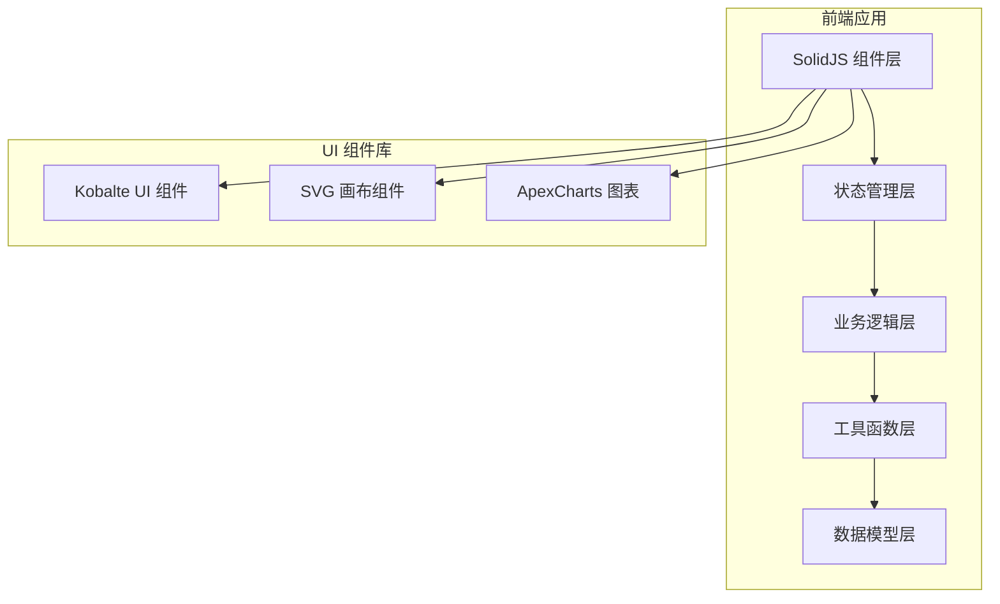

## 1. 架构设计


## 2. 技术描述
- **前端框架**：SolidJS@1.8 + TypeScript@5 + Vite@5
- **UI 组件库**：@kobalte/core@0.13
- **图表库**：apexcharts@3.49 + solid-apexcharts@1.0
- **样式方案**：TailwindCSS@3.4
- **状态管理**：SolidJS 内置 createSignal / createStore
- **图标库**：lucide-solid@0.4
- **构建工具**：Vite@5.0

## 3. 目录结构
```
src/
├── components/          # 组件目录
│   ├── PotteryCanvas.tsx      # SVG 画布组件
│   ├── VesselSelector.tsx     # 器型选择组件
│   ├── EvaluationPanel.tsx    # 评估面板组件
│   ├── PlaybackControls.tsx   # 回放控制组件
│   ├── ConfirmDialog.tsx      # 确认对话框
│   └── MetricCard.tsx         # 指标卡片组件
├── hooks/               # 自定义 Hooks
│   ├── useGestureTracking.ts  # 手势追踪 Hook
│   ├── useContourGenerator.ts # 轮廓生成 Hook
│   ├── useEvaluation.ts       # 评估计算 Hook
│   └── usePlayback.ts         # 回放控制 Hook
├── utils/               # 工具函数
│   ├── geometry.ts            # 几何计算
│   ├── smoothing.ts           # 曲线平滑
│   ├── symmetry.ts            # 对称性计算
│   └── matching.ts            # 匹配度计算
├── types/               # 类型定义
│   └── pottery.ts             # 陶艺相关类型
├── data/                # 静态数据
│   └── vessels.ts             # 目标器型数据
├── App.tsx              # 主应用组件
├── main.tsx             # 入口文件
└── index.css            # 全局样式
```

## 4. 数据模型

### 4.1 核心类型定义
```typescript
// 轨迹点
interface Point {
  x: number;
  y: number;
  timestamp: number;
  pressure?: number;
}

// 器型轮廓点
interface ContourPoint {
  height: number;      // 高度 (0-1)
  radius: number;      // 半径 (0-1)
}

// 目标器型
interface Vessel {
  id: string;
  name: string;
  description: string;
  targetContour: ContourPoint[];
  previewPath: string;
  difficulty: 'easy' | 'medium' | 'hard';
}

// 评估结果
interface EvaluationResult {
  symmetry: number;     // 左右对称性 (0-100)
  smoothness: number;   // 曲线平滑度 (0-100)
  matching: number;     // 目标匹配度 (0-100)
  deviationSegments: DeviationSegment[];
  contour: ContourPoint[];
}

// 偏差区段
interface DeviationSegment {
  startHeight: number;
  endHeight: number;
  maxDeviation: number;
  deviationType: 'too_wide' | 'too_narrow';
}

// 练习状态
interface PracticeState {
  selectedVessel: Vessel | null;
  gesturePoints: Point[];
  generatedContour: ContourPoint[] | null;
  evaluationResult: EvaluationResult | null;
  isRecording: boolean;
  isPlaying: boolean;
  playbackSpeed: number;
  currentPlaybackIndex: number;
}
```

## 5. 核心算法

### 5.1 轮廓生成算法
1. 将手势轨迹点按高度归一化
2. 对每个高度区间，计算左右平均半径
3. 应用 Savitzky-Golay 滤波器平滑曲线
4. 校验高度和半径非负

### 5.2 对称性计算
1. 将轮廓沿垂直中线镜像
2. 计算每个高度点左右半径偏差
3. 归一化得到对称性评分

### 5.3 平滑度计算
1. 计算轮廓曲线的二阶导数
2. 统计曲率突变点数量和幅度
3. 转换为平滑度评分

### 5.4 匹配度计算
1. 使用动态时间规整 (DTW) 算法
2. 计算生成轮廓与目标轮廓的距离
3. 标记偏差超过阈值的区段

## 6. 约束校验
- 目标器型必须先选择，未选择时禁用画布绘制
- 轨迹点数量 < 50 时禁止生成轮廓
- 生成轮廓时校验高度和半径 >= 0
- 回放速度范围：0.5x, 0.75x, 1x, 1.5x, 2x
- 匹配度 < 70 分时标记偏差最大的 3 个区段
- 清空轨迹前弹出确认对话框
